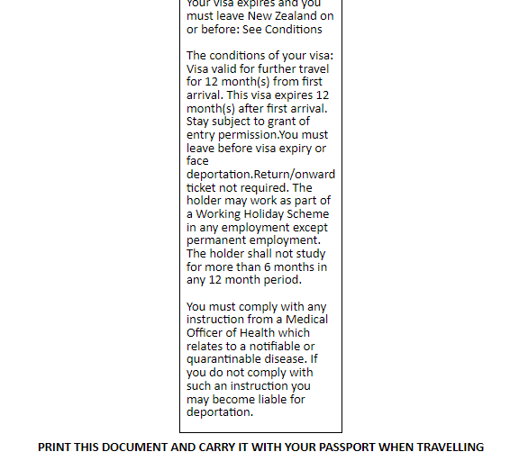
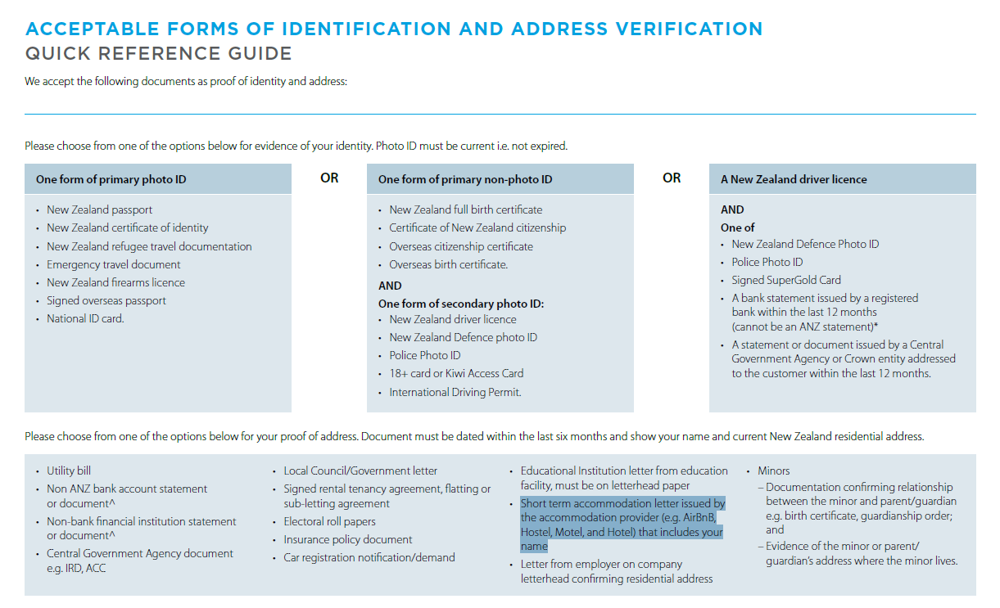

出国前にした手続きや準備をざっくりした時系列でまとめます。脚注に参考になったページのリンクをいくつか載せているように、親切な先達たちがたくさん情報を公開してくれているおかげで順調に準備を進められました。ありがとうございます。

＊私は現地の英語学校には行かないので、それ関連の情報はありません。

### 出発約半年前（2023年6月~）

#### **会社と退職の話をし始める**

「30歳までに仕事を辞めてワーホリに行きたい」という計画は数年前からあり、仕事やいろいろのキリのいいところを考えて退職時期（2023年10月末）を決めました。いわゆる仕事人間だったので未練や後悔なく新しいステップに踏み出せるかという不安はありましたが、十分な時間をかけて気持ちの整理ができていたのがよかったようで、最後はかなりすっきりした気持ちで退職できました。

#### **行く国を決める**

英語の国で、せっかく1年間いるなら見たことがない星を見て過ごせる南半球がいいと思い、オーストラリアかニュージーランドに候補を絞りました。どちらも行ったことがないので迷いましたが、治安が良く・人が親切で・よりゆっくりのんびり生活できそうなイメージのあるニュージーランドに決めました。

### 出発約4か月前（2023年8月~）

#### **Visaを申請する**
- 日本からNZへのワーホリビザは発給人数に制限がないということだったので、申請の時期は気にしませんでした。発行から1年以内に入国すればよいので、ざっくりのスケジュールが決まった時点で申請しました。

- ググって見つかる情報をもとにつまづくことなく進められました。特別な事情（犯罪歴とか）がなければリジェクトくらうことはないんじゃないかと思います。

- 私の場合は、たしか申請と観光税的なものの支払いをした5日後くらいには"*Immigration New Zealand has approved your application for a work visa*"というタイトルで承認の通知メールが来ました。あっというまでびっくりしました。

- eVISAの真ん中あたりの短冊（添付画像参照）を印刷してパスポートに貼ってるんですが、果たしてこれで入国できるんでしょうか。あと、Client NumberとApplication Numberの意味がよくわかっていないです。「ワーホリビザ番号」が必要な手続きがいくつかあって迷いました。

    

#### **旅程と準備のスケジュールを考える**

少しずつ情報収集を始めてTODOリストを作り始めました。失業手当やワーホリ期間中の納税などについても調べました。私の場合は、退職に向けて仕事にフォーカスしたり、その後に東京から実家に引っ越したりで、ワーホリの準備に時間が取れない期間がありました。あらかじめ大まかな計画を立てておいたことで、おかげでやるべきことを・やるべきときに・漏れなくできたと思います。

#### **往路の航空券を予約する**

上述のざっくりスケジュールをもとに、12月下旬の成田→オークランド便でフライトを予約しました。約4か月前で10万円ちょっとでした。

### 出発1~2か前月（2023年10~11月）

#### **到着後しばらくの段取りを考える**

現地生活を始めるにあたり色々とやることはありますが、いろいろと調べていくうちに、それなりに順序だててやっていかないと効率悪くなってしまいそうな印象を受けました。特に住所がないと何をするにも難易度が上がりそうです。私は以下のような段取りで現地生活にランディングしていく計画です。到着からひと月で最初の仕事をゲットできることを目安にがんばりたいです。

1. 到着~2023年いっぱい .. オークランドで免許翻訳・口座開設などの手続き
2. 2024年1月1~2週目 .. 別の町に移動[^1]して家（フラット）探し
3. 2024年1月2~3週目 .. 車探し
4. それ以降 .. 仕事探し

この日程をもとにホテルと国内フライトを手配しました。オークランド最初の数日は中心部近くのよさげなホテルにして、以降はホステル・バッパーと呼ばれる安宿を予約しました。口コミを見ていると話題のトコジラミについての苦情が書かれている宿もあったりして恐怖しています。。

#### **保険に加入する**

- もともと日本の海外保険に加入しようと資料請求したところ、大手はどこも想像以上に高くてちょっと厳しいなと思いました（1年で20万円以上）。現地の保険について調べて、Orbit Protect社のExperience New Zealandプランを勧めている記事が多くそれに加入することにしました[^2]。日本にいても手続きできるので、はやめにやってしまうが吉です。

- 保険のよしあしは実際お世話になったときホスピタリティがわからないと何とも言えないと思うので、残念ながら機会があってしまったときには別の記事で書きたいと思います。

#### **銀行口座の開設準備をする**

- IRDナンバーなるものを取得するにはまず銀行口座を開く必要があるようです。ググって情報の多かったANZを選んで手続きをしました。ただ、ANZは結構時間がかかってあきらめたというような情報[^3]もちらほらあったので、状況に応じて会社を選ぶのと、バックアッププランを考えておくのもよさそうです。

- ①サイトから申し込む、②メールで質問がくる（①から10日後）、③メールで回答する（②の当日）、④現地手続きの日時と場所がメールで指定される（③から3日後）、という流れでした。参考記事[^4]にあるパスポートとビザ承認レターのコピーは求められませんでした。

- ④のメールに、現地で口座をactivateする手続きに"Address verification document"が必要と書かれています。オークランドでホテル滞在中に手続きに行くので、予約したホテルに「チェックイン時にShort term accommodation letter的なものを発行してもらえますか？」と問い合わせていますが、まだ回答は来ていません。参考記事[^4]には「ニュージーランドの住所ではなくオンライン申請時の日本の住所を証明できるもので問題ない」とあるので、英文の残高証明書も持っていこうと思います。

    

#### **スマホの契約を考える**

現地の電話番号がないと生活厳しいだろうし、日本のキャリアを解約するわけにはいかないし、など考えて以下のように二台持ちで行くことにしました。

- NZ機 .. 中古のiPhone12miniを新宿のイオシスで買いました（けっこう安い）。到着したら空港でSIMカードをゲットして入れて、現地生活でのメイン機として使う予定です[^5]。

- 日本機 .. これまで日本で使っていたiPhone SEをそのまま持っていきます。これを機にむかしの楽天モバイルの契約を「Rakuten最強プラン」に切り替えました。海外でもある程度使えるのが嬉しくて、使わなければ使わないで月額約1,000円なので困ったときのバックアップとしてもリーズナブルに思えます。

### 出発月（2023年12月）

To be updated

---

[^1]: まずは王道のフルーツピッキングの仕事をしたく、時期的に仕事がありそうな場所を選びました。 よくまとまっていて参考になったサイトのリンクです。：[ニュージーランドのファームジョブの探し方 \| NZを自力で攻略](https://nz-ryugaku.com/after/job/farm/)
[^2]: 複数の選択肢の比較がよくまとまっていて参考になったサイト。実際の申し込み方法も記事内の「一般プランのお申し込み方法」リンクに飛ぶと詳しく解説されています。：[2分で比較！ニュージーランドのワーホリと留学のおすすめ保険のメリットとデメリット \| NZを自力で攻略](https://nz-ryugaku.com/junbi/hoken/insurance/)
[^3]: [ニュージーランドワーホリで仕事をする時どの銀行口座がおすすめ？ ANZ？BNZ？Kiwi？意外な結果に！\| 倉田典幸オフィシャルブログ](https://nori2-k.com/nzbank/)
[^4]: [ 【NZワーホリ】口座開設におすすめはANZ銀行一択！｜他銀行と比較&手順を徹底解説 \| ユキフルログ](https://yukilogu.com/nz-workingholiday-how-to-open-anz-bank-account/#index_id13)
[^5]: NZ用のSIMカードはこういう比較をしてくれている記事を読んで調べておこうと思います。：[ニュージーランドワーホリでコスパ最強のSIMはコレ【空港のトラベルSIMがお得】\| 10万円でNZワーホリ](https://kaigai-free-life.com/sim/)
