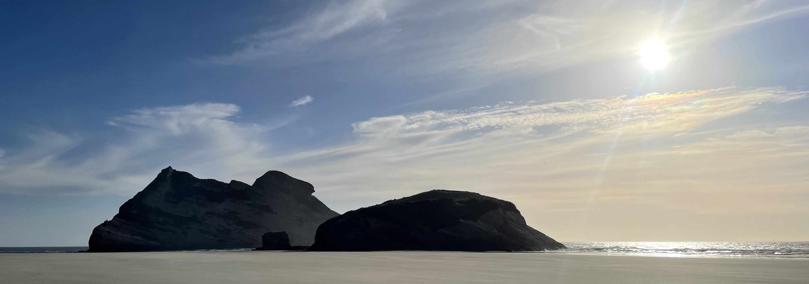

     

 
ニュージーランドを旅した記録のまとめです。

<h3>
<a href="https://sonoinnz.com/2024/05/06/%E6%AF%8D-in-nz.html" target="_blank">
2024-05-06 母 in NZ
</a>
</h3>

> 私たちの4日間の旅の記録に沿ってオークランドの見どころを紹介します。

<h3>
<a href="https://sonoinnz.com/2024/07/03/city-of-beers.html" target="_blank">
2024-07-03 City of Beers
</a>
</h3>

> 私の旅の記録を通して、みなさんにもネルソンの魅力を感じてもらえたらなによりです。

<h3>
<a href="https://sonoinnz.com/2024/11/19/the-south.html" target="_blank">
2024-11-19 The South
</a>
</h3>

> 南島に2泊3日の旅行に行ってきた日記です。普段生活しているオークランドではできない・見られないニュージーランドを体験したいという気持ちで、南島の中でも南側にあるクイーンズタウンとダニーデンという街を目的地に決めました。

